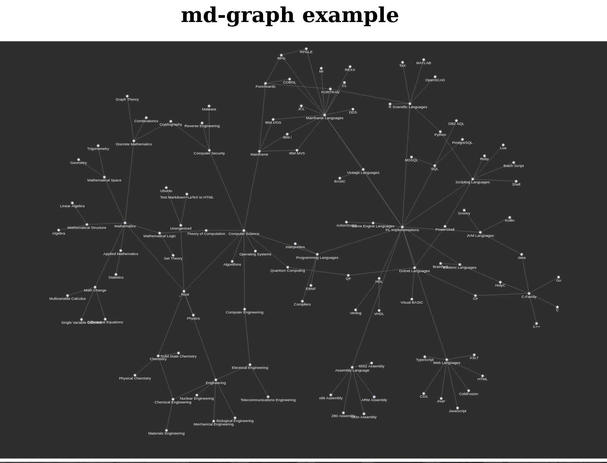

# md-graph
Generate interactive network graph from markdown link relationships.

Example at https://barrettotte.github.io/md-graph/

## Concept
- Parse directory of markdown files to build link dictionary
- Rework dictionary to build network graph
- Generate visualization network graph
- Export to static HTML with links to individual files on each node.


## Intended Usage
- GitHub Actions build step in a static site for my personal notes
- ```python3 mdgraph/mdgraph.py example/mdgraph_config.json```


## Examples
Example at https://barrettotte.github.io/md-graph/

<figure>
  <p align="center">
    
    <figcaption>
      <p align="center">Another example using my Notes repository</p>
    </figcaption>
  </p>
</figure>


## References
- https://regexr.com/
- pyvis - https://pyvis.readthedocs.io/
